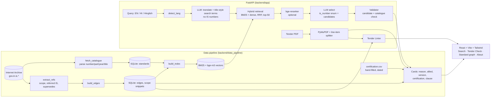

# SpecSure — SIH26108 (Team "Ding Ding")

AI-powered recommendation of applicable **Indian Standards** for procurement specifications
(Ministry of Consumer Affairs / Bureau of Indian Standards).

> **Prototype — verify on BIS Know Your Standards.** The catalogue is an older Internet Archive
> snapshot; "latest version" always means *as per our catalogue*.

A procurement officer pastes a spec line (English, Hindi or Hinglish) or uploads a tender PDF and gets,
per line item: ranked Indian Standards with a one-line reason, allied standards (normative references,
test methods, terminology, other parts of the same IS), version/supersession status, a dated
certification hint (only when a hand-verified row exists) and a copy-ready tender clause. A Tender Linter
flags risky citations and wording.

## Hard rules baked into the code
| Rule | How it is enforced |
|---|---|
| No IS number/title/year/certification rule from memory | Everything comes from downloaded data (`data/catalogue.jsonl`, extracted edges, `certification.csv`); unknown shows "unknown" |
| LLM may only choose retrieved candidates | JSON schema whose `is_number` is an **enum of the candidates**; then `validator.py` re-checks candidate + catalogue membership, drops and logs the rest (`data/invented_is_log.jsonl`). A reason is kept only if the numbers and certification terms it states appear in the candidate line or the requirement |
| No BIS texts in git | Only metadata, ≤800-char scope snippets and reference links are stored; raw downloads live in `data/raw/` (git-ignored); OCR text is processed in memory and discarded |
| Polite scraping | 1 request/second, on-disk cache, exponential backoff (`data_pipeline/common.py`) |
| Free stack, keys not in git | Gemini free tier → Groq fallback; keys read from `.env` (`.env.example` committed) |

## Architecture

Without LLM keys (or when both providers fail) `/recommend` degrades to retrieval-only results
(`X-LLM-Used: false`) and the UI says so.

## Setup
```bash
cp .env.example .env            # add GEMINI_API_KEY / GROQ_API_KEY (optional; app works without)
cd backend
python -m venv .venv && source .venv/bin/activate   # Windows: .venv\Scripts\activate
pip install torch --index-url https://download.pytorch.org/whl/cpu   # CPU torch first
pip install -r requirements.txt
```
On Windows use the python.org Python (`py -3.12 -m venv .venv`); MSYS2/mingw Python cannot install the
torch/faiss wheels.

Build the data (order matters; each step is cached/resumable). A fresh clone needs only these three,
because `catalogue.jsonl`, `subset_ids.json` and `refs_extracted.jsonl` are committed:
```bash
python -m data_pipeline.fetch_catalogue   # ~2 s: committed catalogue.jsonl snapshot -> SQLite
                                          # (--refresh re-downloads from the archive.org Scraping API, ~2 min)
python -m data_pipeline.build_edges       # edges table + scope snippets (re-run after fetch_catalogue)
python -m data_pipeline.build_index       # BM25 + bge-m3 (~2.3 GB download); first run ~15-75 min on CPU,
                                          # later runs re-embed only changed docs
                                          # (EMBED_MODEL=intfloat/multilingual-e5-small is faster)
```
To change or grow the relation subset (after `build_index`, which `select_subset` reads):
```bash
python -m data_pipeline.select_subset     # ~300 standards in 3 verticals (steel/cement, cables/electrical, pipes/plumbing)
python -m data_pipeline.extract_refs      # ~20-60 min, 1 req/s: scope + referred IS + supersession (resumable;
                                          # --retry-failed re-attempts failed downloads)
# then build_edges and build_index again
```
Run:
```bash
uvicorn app.main:app --port 8000
cd ../frontend && npm install && npm run dev      # http://localhost:5173 (proxies /api -> :8000)
```
Tests / eval (from `backend/`):
```bash
python -m pytest tests                            # LLM is stubbed
python -m data_pipeline.check_certification       # validate your hand-filled certification.csv
python -m eval.from_tenders tenders/*.pdf         # real tender PDFs -> eval/tender_rows.jsonl (review the rows)
python -m eval.run_eval --file eval/tender_rows.jsonl   # metrics + the rows the full pipeline missed
python -m eval.run_eval                           # default file eval/eval_set.jsonl (gold_is still empty)
```
Model ids are overridable (`GEMINI_MODEL`, `GROQ_MODEL`, `EMBED_MODEL`, `RERANK_MODEL`); check the
providers' current free-tier names. A Docker setup is not included. GitHub Actions
(`.github/workflows/ci.yml`) runs the tests and the frontend build on every push and pull request.

## API
| Endpoint | Purpose |
|---|---|
| `GET /health` | liveness + `search_model_ready` (the embedding model loads in the background for ~15-40 s after startup) |
| `POST /recommend {text, lang?, top_k=10}` | ranked cards: `is_number,title,year,relevance,reason,confidence,supersedes_info,allied[],certification,source_url,clause` (+ headers `X-LLM-Used`, `X-Detected-Lang`) |
| `POST /analyze-tender?offset=0` (multipart PDF) | line items + recommendations + linter flags, 40 items per call; `next_offset` (or `null`) requests the next page |
| `GET /standard/{is_number}` | details, editions, scope extract, allied list, graph nodes/links |
| `GET /stats` | catalogue size, edges by type, last sync |

### Tender Linter
| Flag | Severity | Rule |
|---|---|---|
| superseded | red | cited IS is the older side of a `supersedes` edge |
| no_certification | red | active `certification.csv` row applies but the item has no certification wording |
| not_in_catalogue | amber | cited IS not in our (older) catalogue |
| older_edition | amber | cited year < catalogue's latest year |
| brand_name | amber | ®/™, "Make: X", "M/s X" without "or equivalent" |

### Edge types
`normative_ref`, `test_method` and `terminology` come from the referred-standards list (typed by the
target's catalogue title); `scope_ref` = named only in the Scope clause; `supersedes` from
"(Superseding IS …)" notes in catalogue titles and foreword sentences; `same_series` (other parts of
the same IS number) is derived from the catalogue at query time. Edges are stored only for the ~300
extracted standards (plus title-based supersession catalogue-wide).

## Filling in your own data
* **Certification draft (helper):** save bis.gov.in "Products under Compulsory Certification → Scheme I
  (ISI Mark)" as PDF, then `python -m data_pipeline.qco_orders "<saved>.pdf"` (~20 min first time, 1
  request/s). It writes `data/raw/certification_draft.csv`: each product with a suggested start date and the
  exact order text it came from. Confirm the rows you need and copy them into `certification.csv` yourself;
  orders that are scanned images (e.g. the 2003 Cement and Electrical Wires orders) have no evidence.
* **Certification:** `data/certification.csv` (header only). Copy from bis.gov.in "Products under
  Compulsory Certification": `product,is_number,scheme (ISI/QCO|CRS|Hallmarking),order_reference,
  effective_date,withdrawn_date,source_url,last_verified`. Run `check_certification` afterwards. The app
  shows certification only for rows that are active today.
* **Evaluation:** download real tender PDFs (CPPP / GeM bid documents with technical specifications) into a
  folder and run `python -m eval.from_tenders <folder>/*.pdf`. Each line item that cites an IS becomes a row
  whose query is the item text with the citations removed and whose `gold_is` is what the tender cited. Review
  the rows (delete ones where the citation is not about the item), then `python -m eval.run_eval --file
  eval/tender_rows.jsonl`. Alternatively fill the empty `gold_is` in `backend/eval/eval_set.jsonl` by hand.

## Demo script (5 minutes)
1. **About** tab: catalogue size, edges, honest disclaimers (older snapshot).
2. **Search** "PVC pipes for drinking water supply" → primary IS badge, reason, allied chips grouped by
   type, version badge, **Copy tender clause**, Source link.
3. Search the Hindi example and "pani ke liye pvc pipe" (Hinglish).
4. Click an IS badge → **Standard** page with the allied-standards graph; click a node to walk the graph.
5. **Tender Check** → upload `docs/sample_tender.pdf` (synthetic) → red/amber flags → **Export audit report**.
6. Mention the safeguards: enum-constrained LLM, validator log, no BIS texts in git.

## Current data snapshot (this build)
* 22,025 catalogue records → 19,700 searchable standards (latest edition each).
* References/scope/supersession extracted for 298 of 300 subset standards (2 archive downloads keep
  failing): 1,300 stored edges (909 normative_ref, 195 test_method, 47 terminology, 65 scope_ref,
  84 supersedes) and 248 scope snippets. 81% of extracted references resolve to a catalogue entry;
  the rest are standards missing from the older snapshot.
* `certification.csv` is empty until you fill it, so no certification badge/flag appears yet.

## Accuracy (first measurement, 2026-09-30)
42 scoreable line items from 16 real public tender specifications (BHEL, NTPC, NIT, university and
state-utility tenders; `backend/eval/tender_rows.jsonl`, sources in `tender_sources.csv`). The query is
the item text with its IS citations removed; the "correct answer" is what the tender itself cited.

| Setup | Hit@5 | Recall@5 | MRR |
|---|---|---|---|
| Hybrid retrieval (BM25 + dense), no LLM | 0.45 | 0.33 | 0.24 |
| **Full pipeline (LLM expansion + selection, batched as in Tender Check)** | **0.83** | **0.70** | **0.78** |

Invented IS numbers: 0. Caveats: small set (about ±11 points at 95%), rows were filtered by hand from
145 harvested (reasons in `tender_rows_dropped.jsonl`), several rows share a source document, and 6 rows
could not be scored because the cited standard is missing from the older catalogue. Misses are mostly
the right standard with the wrong part (e.g. Part 1 vs Part 3) or a defensible alternative standard.
Reproduce: `python -m eval.run_eval --file eval/tender_rows.jsonl` (about 13 LLM calls).

## Known limitations
* Catalogue is an older archive snapshot (only ~3,200 of 22,025 records are from 2015 or later);
  standards published later are missing and will show "not in catalogue".
* Relations exist for a ~300-standard subset; OCR errors can drop or garble references.
* Retrieval is title-based: abbreviations absent from titles (e.g. "TMT") rely on the LLM's query
  expansion; without keys those queries can miss.
* PDF parsing is heuristic; scanned (image-only) tenders need OCR (not included) and are reported as
  such. GeM bid documents are read by their item sections (BOQ and category layouts); for BOQ bids the
  buyer's specifications are separate "View File" attachments that must be uploaded on their own.
  All-caps text such as "PRICE IS 100" can look like a citation and is flagged "not in catalogue".
* Free-tier LLM quotas are small: Gemini returns HTTP 429/503 under load, so the client cools a
  rate-limited provider down for 60 s and fails over to Groq; if both fail, results are retrieval-only.
  Defaults are `gemini-flash-lite-latest` and Groq `openai/gpt-oss-120b` (the smaller gpt-oss-20b chose
  worse standards in our TMT test). Model names change often; override with `GEMINI_MODEL` / `GROQ_MODEL`.
* LLM reasons are one-line summaries by a small model. Reasons that state a number (grade, size, year,
  another IS) or a certification term not present in the candidate's catalogue line or the requirement are
  dropped, but wording without such facts can still be imprecise. The IS number, title and year always
  come from the catalogue.
* Multi-part standards are the main source of misses (the right IS number with the wrong part), and the
  evaluation set is still small and light on lighting items (7 rows).
